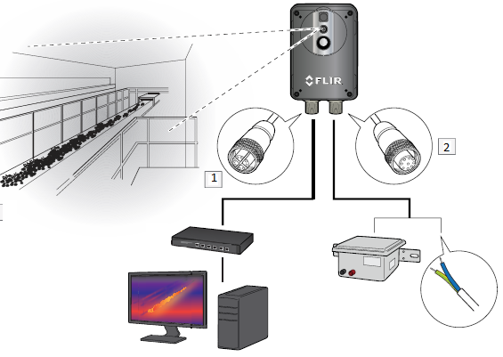

<h1 align="center">Camara: Flir Ax series</h1>

 

 
 

 

Guia para el uso de la camara Flir AX-series 

<!-- TABLE OF CONTENTS -->

  
Contenido

  <ol>
    <li>
      <a href="#conexion">Conexión</a>
         <ul>
         <li><a href=#poe> Conexión Poe </a></li>
         <li><a href=#poe> Conexión digital i/O</a></li>
         </ul>
    </li>
    <li>
      <a href="#Funcionalidades">Funcionalidades</a>
            <ul>
            <li><a href="#interfas">Interfa de la camara
            </a></li>
            <li><a href="#modos de la imagen">Heramientas
            </a></li>
            <li><a href="#ajustes">Ajustes
            </a></li>
            <li><a href="#almacenamiento">Almacenamiento
            </a></li>
            </ul>
    </li>
    
  </ol>

CONEXIÓN

La Camara Flir AX-series cuenta con dos conexiones fisicas que permiten hacer uso de sus distintas 
funcionalidaes dependiendo de las necesidades, las cuales estan dadas por: 

1) Trabajar con una alimentacion a través de Ethernet (POE).

2) Trabajo por conexión digital i/o. 

  

      
      FIGURA 2
  

CONEXIÓN POE

Para esta conexión, conecte un cable M12, X-coded a la entrada POE de la camara ( entrada 1 en la figura 2) y a un switch POE. De igual forma, conecte el pc al switch por medio de ethernet.

una vez conectada camara al pc, se procede a optener la direcion ip de la camara por medio de <a href= "(https://flir.custhelp.com/app/answers/detail/a_id/1137/~/download-flir-ip-config-and-flir-ir-monitor)">FLIR IP_config</a> como se muestra en la Fifura 3

  

      
      FIGURA 3
  

Una vez se tenga la ip de la camara, se copia y se pega en el navegador donde se podra ingresar a la interfaz, con:
#usuario: admin y contraseña: admin o usuario: user y contraseña: user.

NOTA:en caso de tener problemas con la ip de la camara, se debe configurar la ip estatatica por ejemplo: 192.168.0.20 con sub mascara por defecto en el pc y en el navegador escribir 192.16  8.0.10.

Una vez que se ha logrado entrar a la interfaz, se muestarn varias pestañas donde se encontrarán las distintas heramientas y configuraciones de cada pestaña, estas pestañas estan dadas por: camera,settings,storage y help. Así, desde cada pestaña se configura dependiendo de las necesidades u uso que el usuario necesite. 

CONEXIÓN I/O

  

    
    
<b>Figura 4.</b> Cable I/O

  

  

    
    
<b>Figura 5.</b> Alimentación

  

Para la alimentacion de poder de la camara por medio de I/O, se deben conectar los pines 1 y 8 a la fuente de alimentacion, además, para poder obtener una salida digital se deben conectar a una alimentacion de entre 10 y 25V los pines 3 y 4.

  

    
    
<b>Figura 6.</b> Alimentación de la salida digital

  

El pulso de salida se obtiene por el pin 5.

CONFIGURACIÓN DE ALARMA POR SALIDA DIGITAL

Una vez dentro del web server de la camara, se deben seguir los siguientes pasos:

1. seleccionar un recuadro de inspección
2. seleccionar el icono de la camapana
3. se activa la alarma
4. se seleciona la condicion que activará la alarma
5. se selecciona el valor de temperatura umbral
6. se selecciona la duración que se debe cumplir dicha temperatura para que se active la alarma
7. se selecciona si se desea guardar una image, video o ninguna (actualmente desconocemos la cantidad de memoria de la camara)
8. se selecciona la duracion del pulso que se va a generar debido a la alarma
9. se selecciona <i>digital out</i> como acción que se va a tomar una vez se active la alarma

  

    
    
<b>Figura 7.</b> Activación alarma

  

La activacion de la alarma se peude verificar midiendo con el multimetro entre el pin 5 y tierra. Se debe tener en cuenta que son pulsos con una duracion finita.